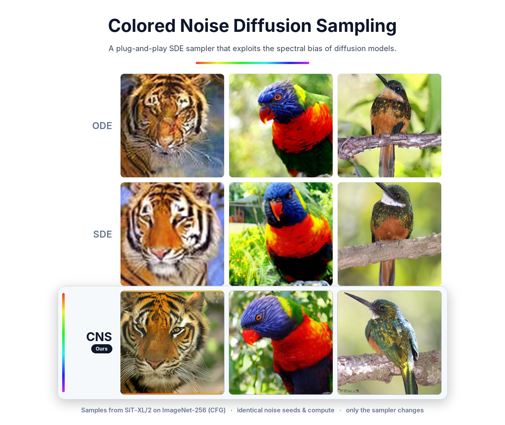
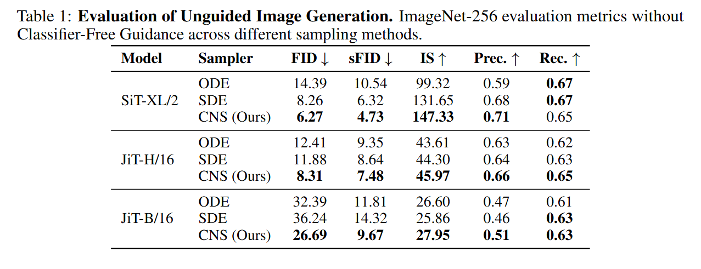
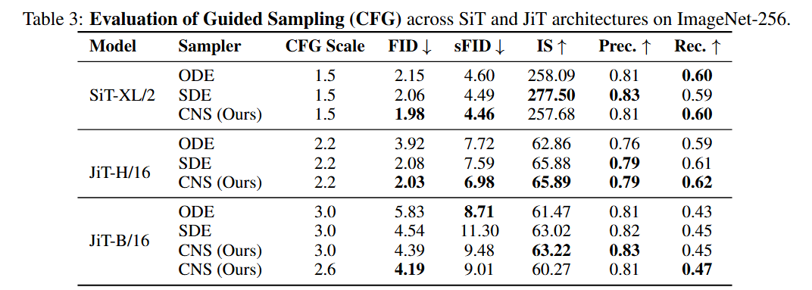

# Colored Noise Diffusion Sampling (CNS)
### *A plug-and-play SDE sampler that actively exploits the spectral bias of diffusion models*

**[Paper](https://arxiv.org/abs/PLACEHOLDER) | [Project Page](https://hadardavidson.github.io/CNS) | [Code](https://github.com/hadardavidson/colored-noise-sampling)**

> **Colored Noise Diffusion Sampling**<br>
> [Hadar Davidson](https://hadardavidson.github.io), [Noam Issachar](https://scholar.google.com/citations?user=Lh0grhUAAAAJ), [Sagie Benaim](https://sagiebenaim.github.io)<br>
> The Hebrew University of Jerusalem



---

## Overview

Diffusion models generate images with a **spectral bias**: low-frequency global structure is resolved early in the sampling trajectory, while high-frequency detail emerges only at the very end. Standard SDE solvers ignore this dynamic entirely — they inject uniform white noise at every step, wasting the finite stochastic energy budget on frequency bands that are already structurally resolved.

**CNS** reconsiders SDE inference as a *targeted energy transfer*. At each step, it measures how "built" each frequency band is via a precomputed progress index γ(f, t) ∈ [0, 1], and dynamically routes injected noise energy toward the bands with the largest remaining structural deficit. A strict global variance-conservation constraint (mean β² = 1) ensures the modified SDE still converges to the target data distribution.

The result is a strictly plug-and-play sampler substitution — same model, same number of steps, only the noise injection changes.

---

## Results

### Unguided ImageNet-256



| Model     | Sampler    | FID ↓ | sFID ↓ | IS ↑   |
|-----------|------------|-------|--------|--------|
| SiT-XL/2  | ODE        | 14.39 | 10.54  | 99.32  |
| SiT-XL/2  | SDE        | 8.26  | 6.32   | 131.65 |
| SiT-XL/2  | **CNS (Ours)** | **6.27** | **4.73** | **147.33** |

### Guided ImageNet-256 (CFG)



| Model     | Sampler    | CFG  | FID ↓ | sFID ↓ |
|-----------|------------|------|-------|--------|
| SiT-XL/2  | SDE        | 1.5  | 2.06  | 4.49   |
| SiT-XL/2  | **CNS (Ours)** | 1.5  | **1.98** | **4.46** |

---

## Setup

Clone and install — the environment is identical to SiT:

```bash
git clone https://github.com/HadarDavidson/colored-noise-sampling.git
cd colored-noise-sampling
conda env create -f environment.yml
conda activate SiT
```

Download the reference batch for FID evaluation from OpenAI:

```bash
# ImageNet 256×256 reference statistics
wget https://openaipublic.blob.core.windows.net/diffusion/jul-2021/ref_batches/imagenet/256/VIRTUAL_imagenet256_labeled.npz
```

---

## Pipeline

CNS requires a **pre-computed gamma matrix** that encodes how each radial frequency band progresses over the sampling trajectory. We include ready-to-use matrices in `gamma_matrix/`, but you can also recompute them yourself.

### Step 1 — Compute the gamma matrix (optional)

Run ODE spectral analysis to accumulate the γ(f, t) matrix. The script iterates until the per-frequency 99.9% confidence interval converges, then saves the raw matrix inside the sample folder:

```bash
# Unguided
torchrun --nnodes=1 --nproc_per_node=4 sample_ddp.py ODE \
    --model SiT-XL/2 \
    --num-sampling-steps 250 \
    --analyze-spectrum \
    --min-spectrum-samples 4096

# Guided (e.g. cfg=1.5)
torchrun --nnodes=1 --nproc_per_node=4 sample_ddp.py ODE \
    --model SiT-XL/2 \
    --num-sampling-steps 250 \
    --cfg-scale 1.5 \
    --analyze-spectrum \
    --min-spectrum-samples 4096
```

A SLURM script is provided for cluster use: `compute_gamma_matrix_sbatch.sh`.

### Step 2 — Scale the gamma matrix

After the raw matrix is saved, open [`scale_gamma_matrix.ipynb`](scale_gamma_matrix.ipynb) to apply the empirical relaxations (progression scaling, optional smoothing) and produce the final `.pt` file used by CNS.

Pre-scaled matrices are already provided in `gamma_matrix/` for the published configurations:

| File | Use |
|------|-----|
| `gamma_matrix/gamma_matrix_scaled.pt` | Unguided (cfg = 1.0) |
| `gamma_matrix/gamma_matrix_scaled_cfg_1.5.pt` | Guided (cfg = 1.5) |

### Step 3 — Run CNS sampling

Pass `--cns` to enable colored noise injection. CNS operates in SDE mode only.

**Quick start — reproduce published results:**

```bash
bash run_cns_best_results.sh unguided   # FID 6.27
bash run_cns_best_results.sh guided     # FID 1.98
bash run_cns_best_results.sh all        # both + SDE baselines
```

**Manual — unguided (FID 6.27):**

```bash
torchrun --nnodes=1 --nproc_per_node=4 sample_ddp.py SDE \
    --model SiT-XL/2 \
    --num-sampling-steps 250 \
    --cfg-scale 1.0 \
    --sampling-method Euler \
    --diffusion-form sigma \
    --last-step Mean \
    --last-step-size 0.04 \
    --cns \
    --gamma-matrix-path gamma_matrix/gamma_matrix_scaled.pt \
    --power-gamma 0.75 \
    --gamma-matrix-divider 1.73 \
    --alpha-tilting 0.15 -0.5 \
    --alpha-tilting-use-fnorm \
    --alpha-exponential-interpolation \
    --alpha-exponential-interpolation-sharpness 0.75 \
    --energy-scale 0.98
```

**Manual — guided (FID 1.98, cfg = 1.45):**

```bash
torchrun --nnodes=1 --nproc_per_node=4 sample_ddp.py SDE \
    --model SiT-XL/2 \
    --num-sampling-steps 250 \
    --cfg-scale 1.45 \
    --sampling-method Euler \
    --diffusion-form sigma \
    --last-step Mean \
    --last-step-size 0.04 \
    --cns \
    --gamma-matrix-path gamma_matrix/gamma_matrix_scaled_cfg_1.45.pt \
    --sqrt-gamma \
    --gamma-matrix-divider 25.0 \
    --alpha-tilting -0.1 0.03 \
    --alpha-tilting-use-fnorm \
    --energy-scale 0.998
```

---

## CNS Flags Reference

| Flag | Type | Default | Description |
|------|------|---------|-------------|
| `--cns` | flag | off | Enable Colored Noise Sampling (SDE only) |
| `--gamma-matrix-path` | str | `gamma_matrix/gamma_matrix_scaled.pt` | Path to the pre-scaled γ(f, t) matrix |
| `--gamma-matrix-divider` | float | 1.0 | Divides γ values before computing the noise schedule; higher values reduce the coloring effect |
| `--power-gamma` | float | 1.0 | Power applied to the residual energy `(1 − γ)` before normalization |
| `--sqrt-gamma` | flag | off | Shorthand for `--power-gamma 0.5`; applies sqrt to residual energy |
| `--energy-scale` | float | 1.0 | Global scale on the final noise std after unit-std normalization; used to fine-tune the heat–contraction balance |
| `--alpha-tilting` | float(s) | 0.0 | Frequency tilt applied to the colored spectrum. One value → constant tilt; two values `start end` → time-varying tilt |
| `--alpha-tilting-use-fnorm` | flag | off | Guide tilt by normalized frequency position (recommended when using two-value tilting) |
| `--alpha-exponential-interpolation` | flag | off | Use exponential (vs. linear) interpolation between the two alpha values |
| `--alpha-exponential-interpolation-sharpness` | float | 4.0 | Sharpness of the exponential alpha interpolation curve |

**For reproducible ODE/SDE/CNS comparison** (same initial latents across all methods):

| Flag | Type | Default | Description |
|------|------|---------|-------------|
| `--per-iter-seed` | flag | off | Seeds each batch independently so ODE, SDE, and CNS all start from identical noise realizations |

---

## Evaluation

After sampling, compute FID using the OpenAI evaluator:

```bash
python evaluator.py VIRTUAL_imagenet256_labeled.npz <sample_folder>.npz
```

`evaluator.py` is from the [OpenAI guided-diffusion repository](https://github.com/openai/guided-diffusion/tree/main/evaluations) and is included in this repo for convenience.

To generate 50K samples across `N` GPUs:

```bash
torchrun --nnodes=1 --nproc_per_node=N sample_ddp.py SDE \
    --model SiT-XL/2 \
    --num-fid-samples 50000 \
    [... CNS flags ...]
```

---

## Acknowledgements

This codebase builds on:

- **[SiT](https://github.com/willisma/SiT)** (Ma et al., ECCV 2024) — model architecture, training code, and SDE/ODE sampling infrastructure.
- **[OpenAI guided-diffusion](https://github.com/openai/guided-diffusion)** — FID/IS/Precision/Recall evaluation suite (`evaluator.py`).

---

## Citation

```bibtex
@article{davidson2025cns,
  title   = {Colored Noise Diffusion Sampling},
  author  = {Davidson, Hadar and Issachar, Noam and Benaim, Sagie},
  journal = {arXiv preprint arXiv:PLACEHOLDER},
  year    = {2025}
}
```

---

## License

This project is under the MIT license. See [LICENSE](LICENSE.txt) for details.
